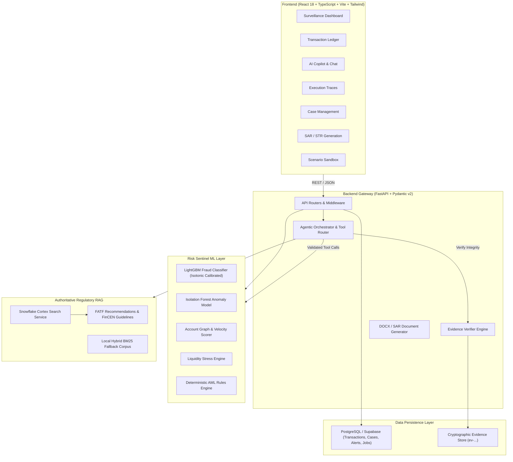

# RAILS — Real-time Anti-Financial Crime Intelligence & Ledger Sentinel

[](https://rails-src-lwnn.vercel.app/)
[](https://fastapi.tiangolo.com/)
[](https://react.dev/)
[](https://www.snowflake.com/)
[](https://supabase.com/)
[](https://www.python.org/)
[](LICENSE)

**RAILS** is an enterprise-grade financial crime intelligence, AML surveillance, and regulatory compliance orchestration platform. It unifies **real-time transaction surveillance**, **calibrated machine learning risk scoring**, **authoritative regulatory retrieval-augmented generation (RAG)**, and an **autonomous AI Copilot** into an end-to-end investigation dashboard.

🔗 **Deployed Web Application**: [https://rails-src-lwnn.vercel.app/](https://rails-src-lwnn.vercel.app/)

---

## 📑 Table of Contents

- [Key Highlights](#-key-highlights)
- [System Architecture](#-system-architecture)
- [Core Platform Capabilities](#-core-platform-capabilities)
  - [1. Executive Surveillance Dashboard](#1-executive-surveillance-dashboard)
  - [2. Multi-Million Transaction Ledger](#2-multi-million-transaction-ledger)
  - [3. Risk & Regulatory Copilot](#3-risk--regulatory-copilot)
  - [4. Agentic Execution & Automation Engine](#4-agentic-execution--automation-engine)
  - [5. Case Lifecycle Management](#5-case-lifecycle-management)
  - [6. Automated SAR / STR Regulatory Reporting](#6-automated-sar--str-regulatory-reporting)
  - [7. Interactive Scenario Simulation](#7-interactive-scenario-simulation)
- [Machine Learning & Risk Sentinel Engine](#-machine-learning--risk-sentinel-engine)
- [Authoritative Regulatory Intelligence (Snowflake Cortex)](#-authoritative-regulatory-intelligence-snowflake-cortex)
- [Cryptographic Audit Evidence & Verifier](#-cryptographic-audit-evidence--verifier)
- [Technology Stack](#-technology-stack)
- [Repository Structure](#-repository-structure)
- [Getting Started & Local Setup](#-getting-started--local-setup)
  - [Prerequisites](#prerequisites)
  - [1. Environment Configuration](#1-environment-configuration)
  - [2. Database Setup & Bulk Import](#2-database-setup--bulk-import)
  - [3. Backend Installation & Run](#3-backend-installation--run)
  - [4. Frontend Installation & Run](#4-frontend-installation--run)
- [API Reference](#-api-reference)
- [Deployment](#-deployment)
- [License](#-license)

---

## ✨ Key Highlights

- **Dual Database Architecture**: Blends high-throughput transactional storage in **PostgreSQL / Supabase** (handling 5M+ row bulk chunked streaming via `COPY`) with **Snowflake Cortex Search** for authoritative legal and compliance corpora retrieval.
- **Calibrated Multi-Model ML Ensemble**: Features an isotonic-calibrated LightGBM model trained on strictly time-separated IBM AML data, unsupervised Isolation Forest anomaly detection, graph account scoring, and liquidity stress analysis.
- **Zero-Hallucination Regulatory Grounding**: Enforces strict verification against indexed statutory guidelines, including **FATF 40 Recommendations**, **FinCEN SAR Electronic Filing Instructions**, and **FinCEN SAR Narrative Completion Guidance**.
- **Immutable Cryptographic Audit Trail**: Every AI tool invocation, risk evaluation, and data point generates an immutable token (`ev-...`) anchoring decisions for compliance auditors.
- **Automated SAR / STR Document Generation**: Automatically drafts legally compliant Suspicious Activity Reports (SAR) and Suspicious Transaction Reports (STR) exportable as formatted Word (`.docx`) filings.
- **Live Cloud Deployment**: Seamlessly hosted on **Vercel** with a dark, high-density financial analytics interface.

---

## 🏛 System Architecture



---

## 🚀 Core Platform Capabilities

### 1. Executive Surveillance Dashboard
- Real-time aggregation of **total processed volume**, **active alerts**, and **high/critical risk transactions**.
- Dynamic risk distribution breakdowns across `CRITICAL`, `HIGH`, `MEDIUM`, and `LOW` tiers.
- Active telemetry monitoring health, status, and versions of all 5 deployed ML models.

### 2. Multi-Million Transaction Ledger
- Searchable and filterable ledger powered by indexed PostgreSQL queries.
- Instant drill-down drawer inspecting sender/receiver accounts, payment formats, amounts, and historical timestamps.
- Color-coded risk badges reflecting multi-dimensional model assessments.

### 3. Risk & Regulatory Copilot
- Context-aware compliance assistant powered by **Google Gemini** and deterministic tool routing.
- Automatically handles:
  - **Account & Counterparty Investigations**: Evaluates fan-in/fan-out degree, velocity spikes, and pass-through patterns.
  - **Transaction Deep Dives**: Explains why a transaction triggered high-risk alerts.
  - **Statutory Guidance Lookups**: Cross-references actions against FinCEN and FATF frameworks.
  - **Interactive Follow-ups**: Formats summaries with verified data references.

### 4. Agentic Execution & Automation Engine
- Live timeline tracking autonomous agent execution steps.
- Inspects exact tool names (`fraud_check`, `anomaly_check`, `rules_check`, `regulatory_search`), arguments, outputs, execution latencies, and associated evidence tokens.

### 5. Case Lifecycle Management
- Full-featured investigation management connecting compliance officers with flagged alerts.
- Prioritizes investigations by severity, associates counterparties, captures review notes, and transitions status from `OPEN` to `UNDER_REVIEW` or `CLOSED`.

### 6. Automated SAR / STR Regulatory Reporting
- One-click synthesis of regulatory draft narratives adhering strictly to the **FinCEN 5-Part Narrative structure** (Who, What, When, Where, Why).
- Includes structured JSON metadata payloads ready for electronic filing.
- Formal compliance approval/rejection lifecycle with direct download of professionally formatted **Word (`.docx`) filings**.

### 7. Interactive Scenario Simulation
- Built-in simulation sandbox for compliance stress testing:
  - **Normal Baseline Flow**: Standard peer-to-peer and commercial transfers.
  - **Rapid Structuring (Smurfing)**: Multiple sub-threshold transactions evading CTR limits.
  - **High-Velocity Layering**: Rapid round-trip and multi-hop account hopping.
  - **Cross-Border High-Risk Flow**: Rapid offshore beneficiary transfers.
- Real-time background job execution with progress bars and immediate alert generation.

---

## 🧠 Machine Learning & Risk Sentinel Engine

The platform incorporates specialized predictive, statistical, and rule-based components trained on the benchmark **IBM AML Transaction Dataset** (`HI-Small_Trans.csv` — 5,078,345 transactions, 515,080 accounts).

| Model / Component | Objective | Methodology | Supervised? |
|---|---|---|---|
| **Fraud Model** | Predicts probability that a transaction represents money laundering (`Is Laundering = 1`) | LightGBM with Isotonic Calibration | **Yes** (Strict time-based split: Train / Val / Test) |
| **Anomaly Model** | Computes behavior percentile `anomaly_score` (0.0 to 1.0) | Isolation Forest | **No** (Unsupervised) |
| **Account Risk Model** | Evaluates structural risk based on fan-in/fan-out, pass-through, velocity, and volatility | Graph heuristics + Isolation Forest | **No** (Unsupervised / Behavioral) |
| **Liquidity Model** | Quantifies liquidity stress and rapid capital drain | Deterministic threshold policy engine | **No** (Deterministic rules) |
| **Credit Model** | Demonstrates default probability under synthetic stress | Logistic Regression / GBM baseline | Synthetic Pipeline Demo |
| **AML Rules Engine** | Instant compliance flag evaluation for statutory thresholds | Deterministic BSA / FinCEN rule checks | **Deterministic** |

### Benchmark Evaluation (Test Split: 1,015,882 transactions)
- **Base Positive Rate**: ~0.177%
- **Lift vs Random**: **58.2x**
- **ROC-AUC**: **0.826** (Validation ROC-AUC: **0.921**)
- **PR-AUC**: **0.103**
- **Precision@100**: **14.0%**
- **Leakage Prevention**: Strictly zero future-data leakage; features only use transaction states strictly prior to the timestamp under evaluation.

---

## 📜 Authoritative Regulatory Intelligence (Snowflake Cortex)

RAILS eliminates LLM hallucination in regulatory matters by grounding generation in authoritative legal publications:

1. **FATF 40 Recommendations** (International Standards on Combating Money Laundering and the Financing of Terrorism & Proliferation).
2. **FinCEN SAR Electronic Filing Instructions** (Guidance for BSA Form 111).
3. **FinCEN SAR Narrative Completion Guidance** (Standards for reporting suspicious activity).

### Retrieval Architecture
- **Snowflake Cortex Search**: Chunks and metadata are stored in `RAILS_DB.REGULATORY.REGULATORY_CHUNKS` and indexed via `REGULATORY_SEARCH_SERVICE` for low-latency vector/hybrid retrieval.
- **Local Fallback**: An offline BM25 vector-free corpus index (`regulatory_corpus.json`) ensures continuous search operation even if cloud connectivity is disabled.

---

## 🔒 Cryptographic Audit Evidence & Verifier

Financial crime compliance demands strict traceability. RAILS implements a two-tier safety layer:

- **Immutable Evidence Store (`evidence_store`)**: Every tool call records inputs, outputs, timestamps, and caller context, generating a signed token ID (`ev-<uuid>`).
- **Strict Verifier (`verifier`)**:
  - Validates numerical boundary conditions (e.g., $0.0 \le \text{risk\_score} \le 1.0$).
  - Verifies that generated investigation narratives only reference valid, uncorrupted evidence IDs.
  - Verifies that cited regulatory statutory chunks exist in the authoritative database.

---

## 💻 Technology Stack

### Frontend
- **Framework**: [React 18](https://react.dev/) + [TypeScript](https://www.typescriptlang.org/)
- **Bundler & Tooling**: [Vite](https://vitejs.dev/)
- **Styling**: [Tailwind CSS](https://tailwindcss.com/)
- **Icons**: [Lucide React](https://lucide.dev/)
- **Markdown Rendering**: [react-markdown](https://github.com/remarkjs/react-markdown) + [remark-gfm](https://github.com/remarkjs/remark-gfm)
- **Hosting**: [Vercel](https://vercel.com/)

### Backend
- **Framework**: [FastAPI](https://fastapi.tiangolo.com/) + [Uvicorn](https://www.uvicorn.org/)
- **Data Validation**: [Pydantic v2](https://docs.pydantic.dev/latest/)
- **LLM Engine**: [Google Gemini](https://ai.google.dev/) (`gemini-2.5-flash` / configurable)
- **ML & Data Processing**: [LightGBM](https://lightgbm.readthedocs.io/), [scikit-learn](https://scikit-learn.org/), [NumPy](https://numpy.org/), [Pandas](https://pandas.pydata.org/), [Joblib](https://joblib.readthedocs.io/)
- **Document Generation**: [python-docx](https://python-docx.readthedocs.io/)

### Databases & Cloud
- **Relational DB**: [PostgreSQL](https://www.postgresql.org/) / [Supabase](https://supabase.com/) (`psycopg3`, connection pooling, bulk `COPY` operations)
- **Data Warehouse**: [Snowflake](https://www.snowflake.com/) (`snowflake-connector-python`, Cortex Search)

---

## 📁 Repository Structure

```
RAILS/
├── README.md                           # Main Project Documentation
├── server.log                          # Local execution logs
├── database/                           # Database schemas & ingestion scripts
│   ├── schema.sql                      # PostgreSQL / Supabase DDL (transactions, cases, alerts, reports)
│   ├── import_transactions.py          # High-speed bulk CSV streaming importer (COPY in 50k chunks)
│   ├── verify_transactions.py          # Database integrity & verification script
│   └── README.md                       # Ingestion documentation
├── backend/                            # FastAPI backend microservice
│   ├── main.py                         # Application entrypoint & overview endpoints
│   ├── config.py                       # Configuration & environment variable loading
│   ├── requirements.txt                # Python backend dependencies
│   ├── api/                            # REST route controllers
│   │   ├── transactions.py             # Ledger queries & details
│   │   ├── alerts.py                   # Risk surveillance alerts
│   │   ├── cases.py                    # Case management lifecycle
│   │   ├── copilot.py                  # AI Copilot chat & tool-calling endpoint
│   │   ├── executions.py               # Agent execution trace endpoints
│   │   ├── reports.py                  # SAR/STR generation & approvals
│   │   ├── regulatory.py               # Regulatory search & chunk lookup
│   │   ├── risk.py                     # Account and transaction risk scoring
│   │   └── evidence.py                 # Evidence store queries
│   ├── db/                             # Persistence & repositories
│   │   ├── persistence.py              # PostgreSQL connection management
│   │   └── repositories/               # Data access repositories
│   ├── ml/                             # Machine learning inference engine
│   │   ├── model_loader.py             # Safe model deserialization & status checks
│   │   ├── inference.py                # Online model inference runners
│   │   ├── feature_adapter.py          # Real-time feature calculation
│   │   └── rules.py                    # Deterministic AML rule definitions
│   ├── llm/                            # AI Orchestration & Tool Calling
│   │   ├── gemini_client.py            # Google Gemini API client
│   │   ├── orchestrator.py             # Intent routing, planning, and multi-tool execution
│   │   └── prompts.py                  # System prompts & compliance persona instructions
│   ├── tools/                          # Registered Copilot tools & contracts
│   │   ├── contracts.py                # Schema validation for tool calls
│   │   └── runner.py                   # Tool execution dispatcher
│   ├── verification/                   # Truthfulness & consistency verification
│   │   └── verifier.py                 # Mathematical, evidence, and regulatory citation verifier
│   ├── evidence/                       # Audit trail
│   │   └── store.py                    # In-memory / persistent evidence store
│   ├── services/                       # Business logic services
│   │   ├── case_service.py             # Case state transitions
│   │   ├── report_service.py           # SAR drafting service
│   │   ├── regulatory_rag_service.py   # Hybrid Snowflake Cortex / local RAG
│   │   ├── risk_service.py             # Aggregated risk assessment engine
│   │   └── simulation_service.py       # Multi-scenario synthetic transaction simulator
│   ├── regulatory_docs/                # Authoritative regulatory corpora & cache
│   ├── snowflake/                      # Snowflake DDL & Cortex search connector
│   ├── risk_out/                       # Trained ML artifacts, model registry & training summaries
│   └── tests/                          # Pytest integration & unit test suite
└── frontend/                           # React 18 + Vite frontend
    ├── index.html                      # HTML entry point
    ├── vite.config.ts                  # Vite build configuration
    ├── package.json                    # Node dependencies & scripts
    ├── tailwind.config.js              # Tailwind styling configuration
    └── src/
        ├── App.tsx                     # Main layout & hash router
        ├── components/                 # Reusable UI components (AppShell, RiskBadge, RiskBar, SignalCard)
        ├── pages/                      # 7 Platform views
        │   ├── DashboardPage.tsx       # Executive overview & KPIs
        │   ├── TransactionsPage.tsx    # Transaction ledger & drawer
        │   ├── CopilotPage.tsx         # AI Copilot interactive chat
        │   ├── AutomationPage.tsx      # Agent execution traces
        │   ├── CasesPage.tsx           # Case management
        │   ├── ReportsPage.tsx         # SAR/STR reporting & DOCX downloads
        │   └── SimulationPage.tsx      # Interactive fraud simulation
        └── lib/                        # API fetcher & utilities
```

---

## 🛠 Getting Started & Local Setup

### Prerequisites
- **Python 3.10+** (Python 3.10, 3.11, or 3.12 recommended)
- **Node.js 18+** and **npm**
- **PostgreSQL** database (Local instance or free [Supabase](https://supabase.com/) project)
- **Google Gemini API Key** ([Google AI Studio](https://aistudio.google.com/))
- *(Optional)* **Snowflake Account** (For cloud Cortex Search; the system automatically falls back to the embedded corpus if not configured)

---

### 1. Environment Configuration

#### Backend Configuration
Create a `.env` file inside `backend/.env`:
```ini
# Database Connections
READ_DB_URL=postgresql://postgres:[PASSWORD]@[HOST]:[PORT]/[DB_NAME]
WRITE_DB_URL=postgresql://postgres:[PASSWORD]@[HOST]:[PORT]/[DB_NAME]

# LLM Configuration
GEMINI_API_KEY=your_gemini_api_key_here
LLM_PROVIDER=gemini
LLM_MODEL=gemini-2.5-flash

# Optional: Snowflake Cortex Search
SNOWFLAKE_USER=your_user
SNOWFLAKE_PASSWORD=your_password
SNOWFLAKE_ACCOUNT=your_account_locator
SNOWFLAKE_DATABASE=RAILS_DB
SNOWFLAKE_SCHEMA=REGULATORY
SNOWFLAKE_WAREHOUSE=COMPUTE_WH
```

#### Frontend Configuration
Create a `.env` file inside `frontend/.env`:
```ini
VITE_API_BASE_URL=http://localhost:8000
```

---

### 2. Database Setup & Bulk Import

1. In your PostgreSQL / Supabase SQL console, execute `database/schema.sql` to initialize tables and indexes:
   ```sh
   psql -d "YOUR_POSTGRES_URL" -f database/schema.sql
   ```
2. *(Optional)* Bulk stream the IBM AML transaction dataset into PostgreSQL:
   ```sh
   python3 database/import_transactions.py
   ```
   *(Add `--truncate` to reset existing tables prior to import)*.
3. Validate table integrity:
   ```sh
   python3 database/verify_transactions.py
   ```

---

### 3. Backend Installation & Run

```sh
# Navigate to backend directory
cd backend

# Create and activate virtual environment
python3 -m venv venv
source venv/bin/activate  # On Windows: venv\Scripts\activate

# Install dependencies
pip install -r requirements.txt

# Run the FastAPI server
uvicorn main:app --host 0.0.0.0 --port 8000 --reload
```
The interactive Swagger API documentation will be available at: `http://localhost:8000/docs`.

---

### 4. Frontend Installation & Run

```sh
# Navigate to frontend directory
cd frontend

# Install dependencies
npm install

# Start Vite development server
npm run dev
```
Open your browser at `http://localhost:5173`.

---

## 📡 API Reference

| Method | Endpoint | Description |
|---|---|---|
| `GET` | `/health` | Healthcheck and status of all 5 ML models |
| `GET` | `/overview` | Aggregated executive KPIs, alert counts, and risk distribution |
| `GET` | `/transactions` | Paginated transaction ledger with search and filters |
| `GET` | `/transactions/{id}` | Detailed risk profile for an individual transaction |
| `POST` | `/risk/transactions/{id}/analyze` | Triggers on-demand multi-model risk analysis |
| `GET` | `/risk/accounts/{id}` | Evaluates structural account risk and velocity |
| `GET` | `/alerts` | Lists surveillance alerts sorted by severity |
| `GET` | `/cases` | Lists active compliance investigations |
| `POST` | `/cases` | Creates a new compliance investigation case |
| `PATCH` | `/cases/{id}` | Updates case status (`OPEN`, `UNDER_REVIEW`, `CLOSED`) |
| `POST` | `/copilot/query` | Conversational query endpoint executing multi-step agentic tools |
| `GET` | `/executions` | Retrieves recent agentic execution traces and tool logs |
| `GET` | `/executions/{id}/steps` | Detailed step-by-step breakdown of an agent execution |
| `GET` | `/regulatory/reports` | Retrieves SAR/STR drafts and submitted reports |
| `POST` | `/reports/generate-str` | Synthesizes an automated FinCEN-compliant SAR draft narrative |
| `POST` | `/reports/{id}/approve` | Formally signs and approves a regulatory filing |
| `GET` | `/reports/{id}/download` | Exports report as a styled `.docx` filing document |
| `GET` | `/regulatory/search` | Searches authoritative compliance guidelines (FATF / FinCEN) |
| `POST` | `/simulation/start` | Initiates synthetic fraud scenario simulation job |
| `GET` | `/simulation/{job_id}` | Polls simulation progress and generated alerts |

---

## 🌐 Deployment

- **Frontend**: The client application is built with Vite and deployed directly to [Vercel](https://vercel.com/):
  - **Live URL**: [https://rails-src-lwnn.vercel.app/](https://rails-src-lwnn.vercel.app/)
- **Backend**: Can be containerized via Docker or deployed to any cloud container service (Render, Railway, AWS ECS, Google Cloud Run) by exposing port `8000` with the corresponding PostgreSQL and Gemini credentials.

---

## ⚖️ License & Compliance Disclaimer

Distributed under the **MIT License**.

> **Regulatory Notice**: RAILS is designed as an investigative surveillance and decision-support accelerator for certified compliance officers and financial analysts. Machine learning scores and AI-generated SAR narratives are draft recommendations subject to human-in-the-loop review before official submission to regulatory authorities (such as FinCEN, FATF, or local FIUs).
